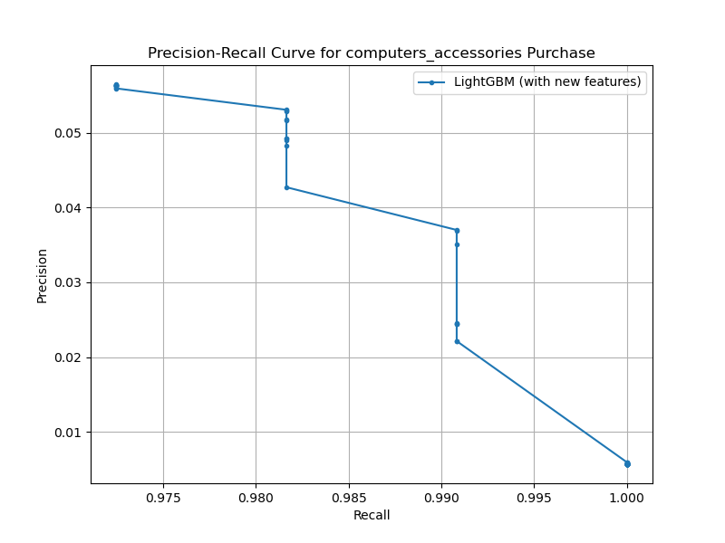

# Olist顧客データを用いた特定カテゴリ購入予測モデル

## 概要 (Overview)

本プロジェクトは、ブラジルのEコマースプラットフォーム「Olist」の公開データセットを用いて、顧客が将来90日以内に特定のカテゴリの商品（今回は `computers_accessories`）を購入するかどうかを予測する機械学習モデルを構築したものです。

データに基づき購入可能性の高い顧客を特定することで、効果的なマーケティング施策の立案を支援することを目標としました。

## データソース (Data Source)

* **データセット名:** Brazilian E-Commerce Public Dataset by Olist
* **提供元:** Kaggle
* **URL:** [https://www.kaggle.com/datasets/olistbr/brazilian-ecommerce]
    * *注意: 本リポジトリにはデータファイル自体は含みません。上記リンクよりダウンロードしてください。*

## 使用技術 (Tech Stack)

* **言語:** Python 3.x
* **主要ライブラリ:**
    * pandas, NumPy (データ操作)
    * Scikit-learn (データ分割, 評価指標, 前処理)
    * LightGBM (機械学習モデル)
    * Matplotlib, Seaborn (可視化)
    * datetime, os (標準ライブラリ)
* **環境管理:** (例: Anaconda, venv)
* **バージョン管理:** Git, GitHub

## 実行方法 (Usage/Installation)

1.  **リポジトリのクローン:**
    ```bash
    git clone [https://github.com/en00-en00/customer-behavior-analysis-]
    cd customer-behavior-analysis-
    ```

2.  **データセットの準備:**
    上記「データソース」のリンクからOlistデータセットをダウンロードし、プロジェクト内の `./olist_data/` ディレクトリ（または `main.py` 内で指定した `data_dir`）に配置してください。(`.gitignore` で管理対象外とすることを推奨します。)

3.  **必要なライブラリのインストール:**
    ```bash
    pip install -r requirements.txt
    ```

4.  **コードの実行:**
    ```bash
    python main.py
    ```
    実行すると、モデルの学習・評価が行われ、評価指標と特徴量重要度、閾値ごとの評価指標がコンソールに出力され、Precision-Recallカーブの画像 (`precision_recall_curve_new_features.png`) が生成されます。
    
## 分析・モデリングプロセス (Process)

1.  **データ準備:** 複数テーブルを読み込み、結合。カテゴリ名を英語化。タイムスタンプをdatetime型に変換。
2.  **目的変数(Y)定義:** 最後の90日間を予測期間とし、期間内に `computers_accessories` を購入した顧客を1、それ以外を0とするラベルを作成。Y=1は約0.57%と**深刻な不均衡データ**であることを確認。
3.  **特徴量(X)作成:** 基準日以前のデータのみを使用し、以下の特徴量を生成。
    * 顧客属性: `customer_state`
    * 全体購買行動: RFM (Recency, Frequency, Monetary)
    * 特定カテゴリ購買行動: 購入経験フラグ、購入回数、購入金額、最終購入日(Recency)
    * 支払情報: 利用支払方法数、平均/最大分割回数、合計/平均支払額
    * レビュー情報: 平均/中央値/最小レビュースコア、レビュー投稿数
4.  **前処理:** カテゴリ変数(`customer_state`)をOne-Hot Encoding。データを学習用(80%)とテスト用(20%)に分割 (`stratify=y` 指定)。
5.  **モデル学習:** LightGBM (`LGBMClassifier`) を使用。不均衡対策として `scale_pos_weight` を設定。Early Stoppingを用いて学習。
6.  **評価:** テストデータで予測確率・予測クラスを計算し、AUC, Precision, Recall, F1-Score, 混同行列で性能を評価。特徴量重要度も算出。
7.  **閾値調整:** Precision-Recallカーブを描画し、閾値変更による指標の変化を確認。

## 結果 (Results)

最終的なモデルのテストデータに対する評価結果は以下の通りです。

* **AUC:** 0.9473
* **Precision (適合率 @ 閾値0.5):** 0.0562
* **Recall (再現率 @ 閾値0.5):** 0.9725
* **F1-Score (@ 閾値0.5):** 0.1063
* **混同行列 (@ 閾値0.5):**
    ```
    [[TN=17332, FP=1779],
     [FN=   3,  TP=106]]
    ```

**Precision-Recallカーブ:**



閾値を0.1から0.9まで変化させても、PrecisionおよびRecallの値はほとんど変化しませんでした。これは、モデルの予測確率が両極端に偏っており、単純な閾値調整によるPrecision改善効果が限定的であることを示唆します。

**特徴量重要度 (Top 10):**

モデルが予測において重要視した特徴量の上位は以下の通りです。

1.  `payment_value_sum` (合計支払額)
2.  `Recency` (最終購入からの日数)
3.  `target_purchase_amount` (特定カテゴリの購入金額)
4.  `Monetary` (全体的な購入金額)
5.  `payment_installments_mean` (平均分割払い回数)
6.  `customer_state_MG` (ミナスジェライス州フラグ)
7.  `customer_state_DF` (連邦直轄区フラグ)
8.  `customer_state_BA` (バイーア州フラグ)
9.  `payment_value_mean` (平均支払額)
10. `review_score_mean` (平均レビュースコア)

## 考察 (Discussion/Conclusion)

本プロジェクトで構築したモデルは、AUCが0.95と高く、購入者と非購入者を識別する能力自体は高いことが示されました。また、Recallも0.97と非常に高く、購入する可能性のある顧客をほとんど見逃さないという利点があります。

しかし、最大の課題はPrecisionが0.056と極端に低い点です。これは、購入すると予測された顧客の約94%は実際には購入しないことを意味し、この予測をそのままマーケティング施策（例: クーポン配布）に利用すると、コスト効率が著しく悪化するリスクがあります。閾値調整の効果も限定的であったことから、モデルの予測確率の分布自体に改善の余地があると考えられます。

特徴量重要度の結果からは、支払総額や最近の購買行動、特定カテゴリへの支出、居住地域などが購入予測に影響を与えることが分かり、ターゲット顧客像の解像度を上げるヒントが得られました。

結論として、現状のモデルは購入潜在顧客の網羅的なリストアップには有効ですが、施策対象者を効果的に絞り込むためには、さらなるPrecisionの改善が不可欠です。

## 今後の課題 (Future Work)

* **ハイパーパラメータチューニング:** LightGBMのパラメータ（学習率、木の深さ、正則化など）をOptuna等を用いて最適化する。
* **特徴量エンジニアリングの深化:**
    * 時間関連特徴量（購入曜日、時間帯、月、購入間隔など）の追加。
    * 顧客セグメント特徴量（RFMランクなど）の作成。
    * 交互作用特徴量の検討。
    * 未利用データ（Geolocation、Seller情報など）の活用。
* **不均衡データ対策の変更:** SMOTE等のサンプリング手法の試行。
* **他モデルの試行:** XGBoost, CatBoost, Logistic Regressionなど、他のアルゴリズムとの比較。